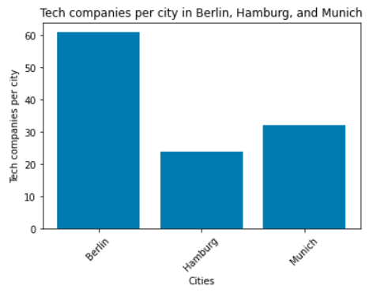

# **Project 3**

### **Company based in Germany**

Because of the strong support for innovation and the pro-business environment, I decided to establish a tech company in Germany. The country provides an ideal environment for tech companies to launch and grow their businesses, with ample funding and resources dedicated to research and development. Furthermore, the German government's favorable tax and regulatory policies enable businesses to operate efficiently and effectively, while the country's stable economic and political climate provides a secure foundation for growth and development. These factors combine to make Germany an ideal location for technology companies seeking to establish a strong presence in Europe while also gaining access to a highly skilled workforce and a vast network of global connections.

### As a tech professional
Working in a company in Germany is like hitting the jackpot! With high wages and generous benefits, you'll be living the good life with more money in your pocket and a full suite of perks. Plus, with strict regulations on working hours and paid leave, you'll finally have a chance to enjoy that work-life balance you've always dreamed of. In Germany, you can live like a king with a high standard of living, quality education system, and vibrant cultural scene. And the cherry on top? With a low unemployment rate and strong job security, you'll feel like you won the career lottery - you'll be working in a place that's stable, secure, and actually values your time off

#### **Tech in Germany**
After deciding that my company would be based in Germany, I decided to use the "companies Data Frame" to determine which city in Germany had the best conditions for establishing a technology company, so I used the three cities with the most technology-related companies as a parameter.

But I wanted the city in which the company decided to locate to be surrounded by other technology companies, therefore, the main criteria for making this decision was the number of tech companies per square kilometer.

Despite the fact that Berlin has the most tech companies, according to "companies DataFrame," Munich has more companies per square kilometer, which may make the task of finding a suitable location for our tech company easier.

#### **Now in Munich**
I decided to use the Foursquare API while looking for the ideal location to establish our tech company in Munich. With this data, we can make an informed decision on the best location for our company, considering factors such as accessibility, proximity to talent, and growth potential.